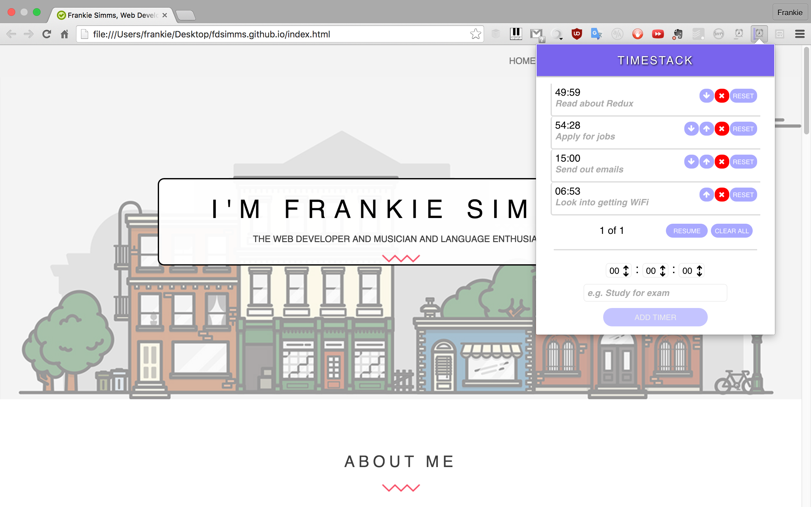

# Timestack

[Download on the Chrome Web Store][chrome-page]

[][chrome-page]
[chrome-page]: https://chrome.google.com/webstore/detail/timestack/hgkefoelcaofbcpfeimjmgofjdlgehof

## Summary
  Timestack allows users to set multiple timers with descriptions in order to plan out their days. It can be used in a variety of circumstances. I could imagine it working well for planning out workout routines (if you want to work out with your laptop nearby!) or planning out studying sessions.

## Usage

Fill in the amount of time you want a timer to run and an optional description of what the timer is for then hit the 'Add Timer' button. Do this for as many timers as you want, then press the 'Start' button to start the first timer. When the first timer is over, the second timer will automatically start.

## Dependencies

* [Angular.js][angular-link]
* [Font Awesome][fa-link]
* [Google Fonts][gf-link]
[angular-link]: https://angularjs.org
[fa-link]: https://fortawesome.github.io/Font-Awesome/
[gf-link]: https://google.com/fonts

## Other

* Bell sound provided by Mike Koenig at [this page][sound-link].

[sound-link]: http://soundbible.com/1746-Ship-Bell.html
